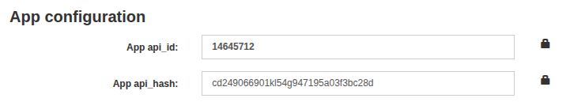

# Для пользователя

Для создания уникального бота в первую очередь потребуется связаться с нашим ботом в Telegram.

### Наш бот в Telegram: [Service Bot](https://t.me/l_servicebot)

## Работа с Service Bot

1. При переходе в бота, нажмите кнопку `Старт`.
2. Выбери тариф, который хотите использовать и купите за звезды Вашего аккаунта Telegram (после покупки Вашему аккаунту автоматически присвоится **ключ лицензии**). Подробнее о тарифах можно посмотреть на нашем [сайте](https://pluttan.github.io/Telegram-Bot-NFT-docs/purchase)
3. После успешной покупки тарифа, можно нажать на кнопку `🔑 Мой лицензионный ключ` и проверить его наличие. Далее следует нажать кнопку `⚙️ Настройки бота` и следовать запросам [Service Bot](https://t.me/l_servicebot).
3. [Service Bot](https://t.me/l_servicebot) попросит у Вас токен для бота, который нужно создать через [@BotFather](https://t.me/BotFather) (официальный бот для создания ботов)
   - Начните диалог командой `/start` c [@BotFather](https://t.me/BotFather)
   - Создайте нового бота командой `/newbot`
   - Укажите имя и username для бота
   - Если все прошло успешно, [@BotFather](https://t.me/BotFather) в тексте пришлет Вам токен вида: `1234567890:ABCdefGHIjklMNOpqrsTUVwxyz123456789`\
   - Скопируйте полученный токен полностью и отправьте в [Service Bot](https://t.me/)
4. **Важный шаг!** Для работы бота с функциями покупки подарков за звезды на Вашем аккаунте необходимо предоставить **API_ID** и **API_HASH** от Вашего аккаунта Telegram. Без этих ключей бот не сможет выполнять основные функции!
    - Перейдите на [my.telegram.org](https://my.telegram.org) (официальный сайт Telegram для разработчиков)
    - Войдите под своим номером телефона (Используйте тот же аккаунт, который будет управлять ботом)
    - После ввода телефона потребуется **Код подтверждения**, который придет Вам в личные сообщения от Telegram. Пример кода: `evBQFaj7ajc`
    - Перейдите в раздел **API development tools**
    - На самом верху во вкладке **App configuration** есть поля **App api_id** и **App api_hash** (см. пример на фото ниже)
    - Скопируйте и отправьте эти данные [Service Bot](https://t.me/) в порядке запроса бота.

  

5. **Приятного использования!**

### 🔒 Конфиденциальность гарантирована
>Ваши **API_ID** и **API_HASH** используются исключительно для авторизации в **Telegram API** и не предоставляют доступа к Вашему аккаунту, сообщениям или личным данным. Это безопасные ключи для работы с официальным **Telegram API**.

## Тарифные планы

1. По месяцам:
   - **SELF-HOST** - 109⭐ (~199₽)
   - **HOSTING** - 169⭐ (~299₽)
   - **HOSTING-PRO** - 249⭐ (~449₽)

2. По годам:
   - **SELF-HOST** - 1090⭐ (~1990₽)
   - **HOSTING** - 1690⭐ (~2990₽)
   - **HOSTING-PRO** - 2490⭐ (~4490₽)