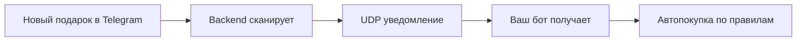

# nftbot

**Автоматическая покупка NFT-подарков в Telegram**

nftbot — это система автоматического мониторинга и покупки NFT-подарков (Gift NFT) в Telegram. Бот сканирует появление новых подарков в реальном времени и мгновенно выкупает их согласно вашим правилам распределения звёзд.

## Возможности

- **Автоматическое сканирование** — мониторинг новых подарков 24/7 в реальном времени
- **Мгновенная покупка** — автоматический выкуп сразу после появления подарка
- **Гибкие правила** — настройка распределения звёзд по цене подарков
- **Service Bot** — удобное управление через Telegram без командной строки
- **Три тарифных плана** — от self-hosted до выделенного VPS

## Как это работает

1. **Backend** непрерывно сканирует Telegram на появление новых подарков
2. При обнаружении нового подарка отправляется **UDP-уведомление** всем подключённым клиентам
3. **Ваш бот** получает уведомление и проверяет подарок по вашим правилам
4. Если подарок подходит под правила — происходит **мгновенная покупка**

## Начало работы

Самый быстрый способ начать — использовать наш [Service Bot](https://t.me/l_servicebot) в Telegram:

1. Перейдите к [@l_servicebot](https://t.me/l_servicebot)
2. Нажмите **Старт**
3. Выберите тарифный план
4. Оплатите звёздами Telegram
5. Следуйте инструкциям по настройке

Подробнее о каждом шаге читайте в разделе [Быстрый старт](./getting-started/quick-start.md).

## Поддержка

Если у вас возникли вопросы или проблемы:

- **Telegram**: [@l_servicebot](https://t.me/l_servicebot) — напишите администратору через меню бота
- **GitHub**: [Создать Issue](https://github.com/fitymico/tgbotnft/issues)
